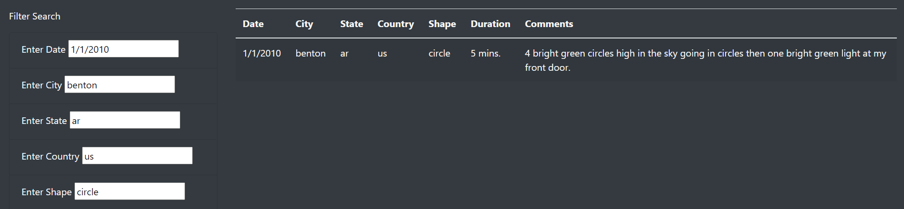

# UFOs-Analysis
## Overview of the Project
The purpose of this project was to create a webpage for Dana which allowed users to search up some basic information about UFO sightings, from specific location searching to shapes and descriptions.
### Results
This webpage has five fields which can be used for filtering, making it easy for one to find what they might be looking for.

One can enter specific bit of information in their respective fields to find related data. For example, if one were curious as to what UFO sightings have occured in the city of El Cajon, they can enter that city name into the city field, press enter or click away and find that El Cajon has had multiple UFO encounters.

If the user knows more than just one piece of information about a recorded UFO sighting, they can fill in multiple fields to narrow down the search and read its descriptions! For example, we looked at the city of Benton, Arizona, US on the first of Janurary, 2010 for a circular shaped UFO, and we are greeted with the exact sighting record we were looking for.

#### Summary
There are some drawbacks to using a system like this. For example, if the user misspells or mistypes in one of the search fields, the table with not show them any results or explain why. An implementation of some sort of error message would be beneficial for both testing as well as user usage.
Some recommendations on future development on this website would be to include an image section within the table of the sightings, to get users more captivated in their search results. Additionally, for those who want to learn more, including hyperlinks to detailed articles of these sightings would elevate the user experience.
